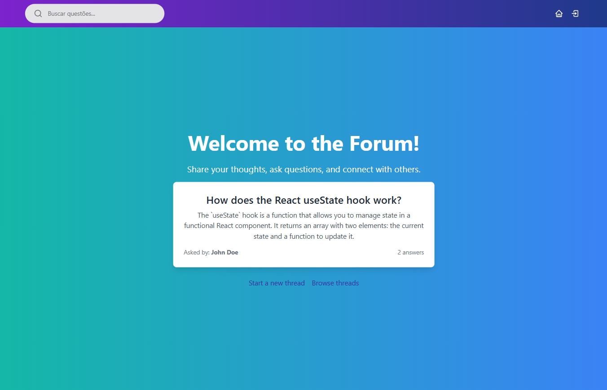
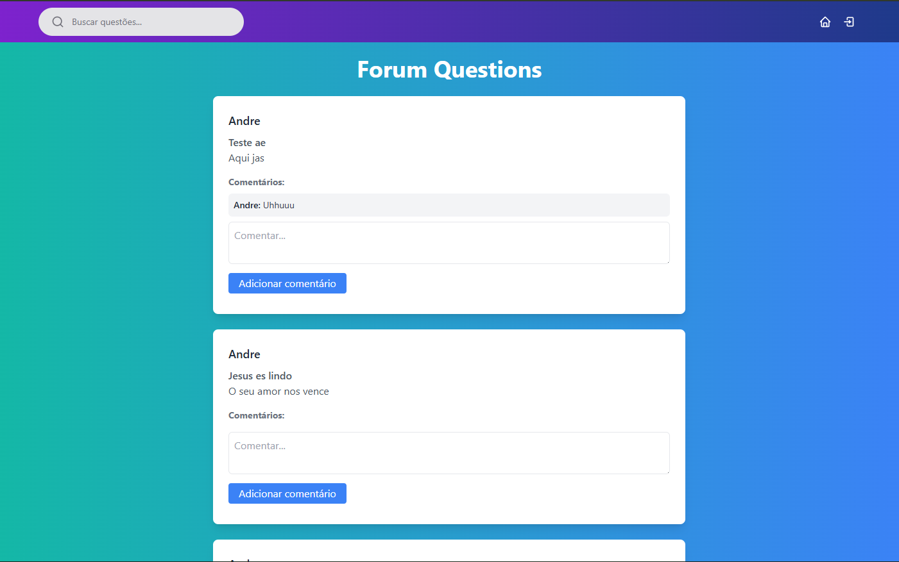
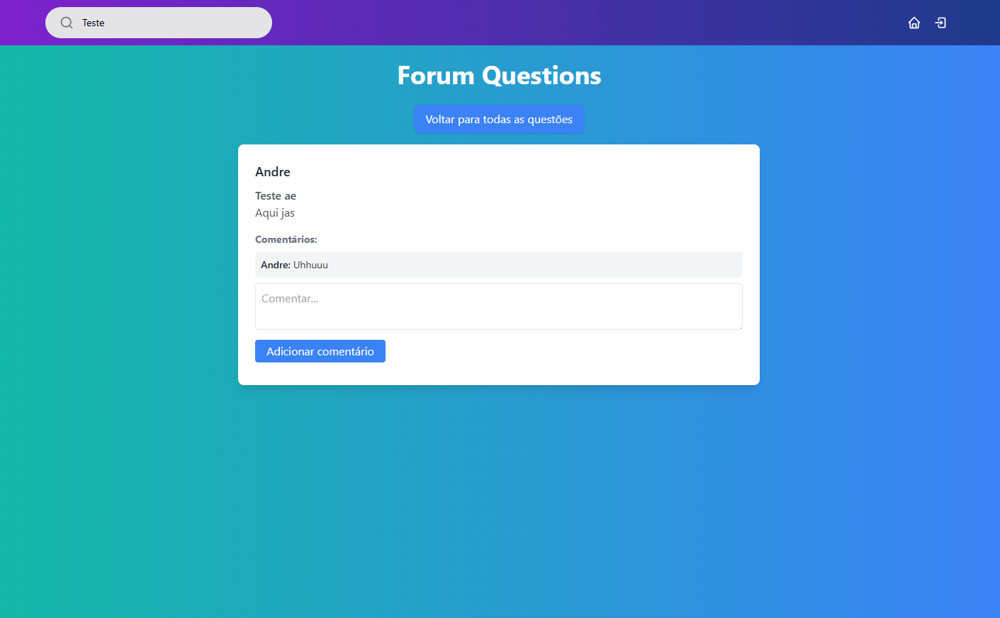

# Fórum 

O fórum serve para tirar dúvidas e possibilitar que os usuários interajam uns com os outros.

## Requisitos do Sistema

Para operar o sistema, são necessários os seguintes requisitos mínimos na sua máquina: Node.js e Docker. O Node.js é necessário para executar a API e o front-end, enquanto o Docker é utilizado para virtualizar o banco de dados. Esses componentes garantem a funcionalidade e o desempenho ideais do nosso sistema de forma integrada e eficiente.

## Requisitos Funcionais

- Deve ser possível que o usuário se cadastre;
- Deve ser possível que o usuário se autentique;
- Deve ser possível que o usuário obtenha o perfil de um usuário logado;
- Deve ser possível que o usuário visualize as questões;
- Deve ser possível que o usuário acesse o seu perfil;
- Deve ser possível que o usuário acesse o perfil de outros usuários;
- Deve ser possível que o usuário busque uma questão pelo título ou conteúdo.

## Regras de Negócio

- O usuário não deve se cadastrar com um e-mail duplicado;
- O usuário não pode criar uma questão sem estar autenticado;
- O usuário não pode comentar sem estar autenticado;

## Requisitos Não Funcionais

- A senha do usuário precisa estar criptografada;
- Os dados da aplicação precisam estar persistidos em um banco de dados;
- O usuário deve ser identificado por um token JWT.

## Arquitetura do Sistema

O sistema utiliza as seguintes tecnologias:

- **Linguagens:** TypeScript
- **Banco de Dados:** PostgreSQL
- **Frameworks:** Fastify, Next.js
- **Arquitetura da API:** RESTful
- **Outras Tecnologias:** React, Docker

## Como Iniciar o Sistema

### Passo 1: Download dos Arquivos

Clone o repositório:

```bash
git clone https://github.com/andre-albuquerque01/forum-connect.git
```

### Passo 2: Configuração do Back-end

Entre na pasta back-end:

```bash
cd /Api
```

Inicialize os pacotes do Node:

```js
npm i
```

Crie um arquivo `.env` na raiz do seu projeto e configure as variáveis de ambiente conforme necessário.

Inicie o servidor da API:

```bash
npm run dev
```

Para desativar o servidor da API:

```bash
ctrl + c
```

### Passo 3: Configuração do Front-end

Entre na pasta front-end:

```bash
cd /app
```

Baixe as dependências do Node.js:

```bash
npm i
```

Inicie o servidor do Next.js:

```bash
npm run dev
```

### Passo 4: Acesso ao sistema

Abra o navegador e acesse `http://localhost:3000` para utilizar o serviço.

### Imagens do sistema

#### A seguir, apresentamos algumas imagens que demonstram as funcionalidades do sistema:

- Início



- Dashboard



- Pesquisa do Item


